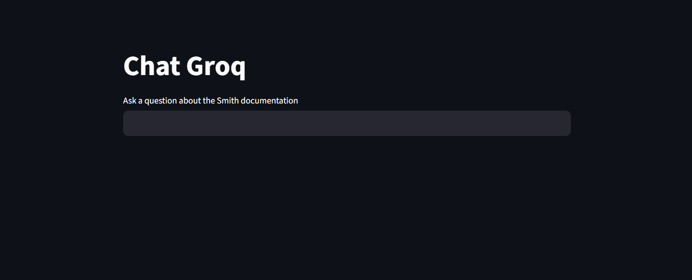

# ChatGroq RAG Bot



A Retrieval-Augmented Generation (RAG) chatbot built with **LangChain**, **Groq LLMs**, **FAISS**, and **Streamlit**.  
This bot loads documentation from the web, splits it into chunks, stores embeddings in FAISS, and answers user queries using **Groq’s `gemma2-9b-it` model**.

---

## Project Structure

```bash
groq/
└── app.py
requirements.txt
README.md
Media/
├── StreamliyUI.png
└── demo.mp4
```

---

## Features

- Uses **Groq LLMs** (`gemma2-9b-it`) for fast inference  
- Retrieval pipeline with **FAISS Vector Store**  
- Embeddings powered by **HuggingFace** (`all-MiniLM-L6-v2`)  
- Loads documents from a website using `WebBaseLoader`  
- Simple **Streamlit UI** for chatting and inspecting retrieved docs  

---

## Setup Instructions

### 1. Clone the repository

```bash
git clone https://github.com/AlakhsimarSingh/QnAChatBot.git
cd QnAChatBot/groq
```

---

### 2. Create and activate a virtual environment

**For Windows:**
```bash
python -m venv venv
venv\Scripts\activate
```

**For macOS/Linux:**
```bash
python -m venv venv
source venv/bin/activate
```

---

### 3. Install dependencies

```bash
pip install -r requirements.txt
```

---

### 4. Set up environment variables

Create a `.env` file inside the `groq/` directory and add your **Groq API key**:

```bash
GROQ_API_KEY=your_groq_api_key_here
```

---

### 5. Run the app

```bash
streamlit run app.py
```

After running the above command, open the URL shown in the terminal (usually **http://localhost:8501**) in your browser.

---

## Usage

1. Enter your query in the input box (e.g., *"What is LangSmith?"*).  
2. The chatbot retrieves relevant documentation chunks from **FAISS**.  
3. Groq’s LLM (`gemma2-9b-it`) generates a **context-aware** response.  
4. Expand the **Documents similarity search** section to inspect retrieved sources.  

---

## Demo

Here’s a short demo of the app in action:  

[](./Media/demo.mp4)

> Click the screenshot above to view the **demo video**.

---

## Requirements

Your `requirements.txt` should include the following:

```txt
langchain
langchain-community
langchain-core
langchain-groq
faiss-cpu
sentence-transformers
streamlit
python-dotenv
groq
```

---

## Notes

- By default, the bot loads documents from **LangSmith Docs**.
- To load custom documents, modify the **`WebBaseLoader`** section in `app.py`.
- You can also switch embeddings (e.g., HuggingFace, Ollama) by updating the embeddings configuration in `app.py`.

---

## Acknowledgements

- [LangChain](https://www.langchain.com/)  
- [Groq](https://groq.com/)  
- [HuggingFace Sentence Transformers](https://www.sbert.net/)  
- [Streamlit](https://streamlit.io/)
